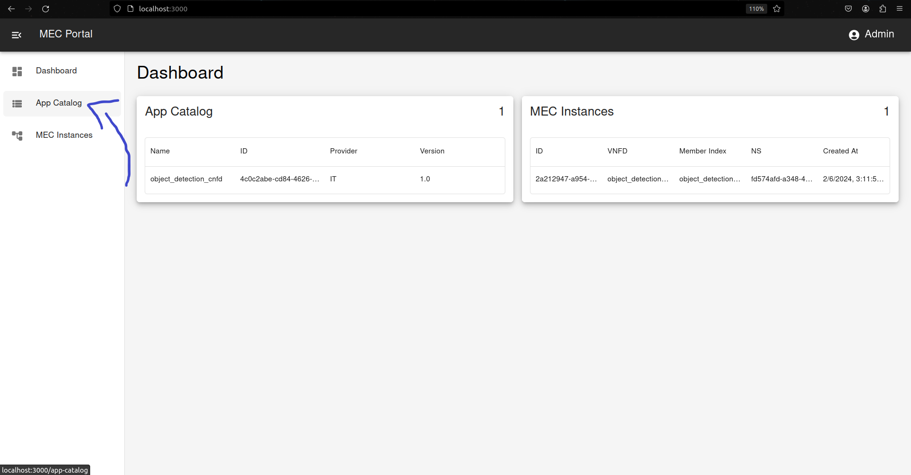
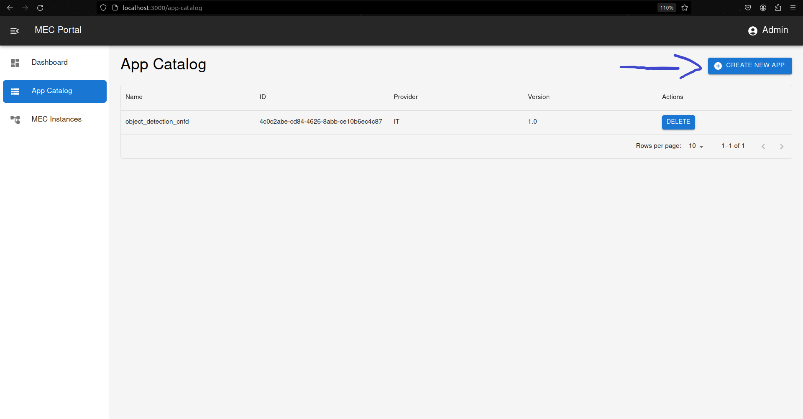

# Getting Started

## Requirements

- [OSM](https://osm.etsi.org/docs/user-guide/latest/03-installing-osm.html#how-to-install-osm)
- `Git`
- [Docker](https://www.docker.com/get-started/)
- [docker compose](https://docs.docker.com/compose/install/)
- `cp` command
- [Kubernetes Cluster](https://docs.k3s.io/quick-start)


## Preparation:

1. **Download Repository:**
    ```bash
    git clone https://github.com/PedroDSFerreira/osm-mec.git
    ```

2. **Create .env file:**

    ```bash
    cp .env-sample .env
    ```

    >Change OSM_HOSTNAME variable to the ip of the machine where OSM is installed

3. **Launch Containers:**

    ```bash
    docker compose up --build
    ```

4. **Add kubernetes cluster to OSM:**

    
   -  Add Vim Account
   ```bash
   osm vim-create --name vim-account-name --user admin --password pwd --auth_url http://example.com --tenant admin --account_type dummy --config='{}'
   ```
   - [Associate cluster to VIM Account](https://osm.etsi.org/docs/user-guide/latest/05-osm-usage.html#adding-kubernetes-cluster-to-osm)
    

>CFS Portal is available at `http://localhost:3000`

## CFS Portal

### Add MEC App to Catalog
After [creating a MEC App Descriptor](mec_app.md), go to `App Catalog` and upload descriptor:



<br></br>



