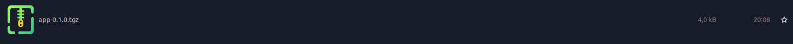

# Create a MEC App Descriptor

1. Create the application
2. **[Containerize the app](https://docs.docker.com/get-started/02_our_app/)**
3. Push the container image to a repository, such as the **[Docker Hub](https://docs.docker.com/get-started/04_sharing_app/)** or **[Github Packages](https://docs.github.com/en/actions/publishing-packages/publishing-docker-images)**
4. Create Helm Chart:
```bash
helm create <chart-name>
```

> You should edit the helm chart to include the container image and other configurations


And then package it:

```bash
helm package <path-to-chart>
```



5. Create MEC App Descriptor
6. Create an archive with app descriptor and helm chart

**The structure of the archive should look like this:**

```perl
appd/
├── helm.tgz
├── appd.yaml
```

>Instead, you can use our [example app](https://github.com/PedroDSFerreira/osm-mec/blob/main/assets/appd-package.tar.gz)


