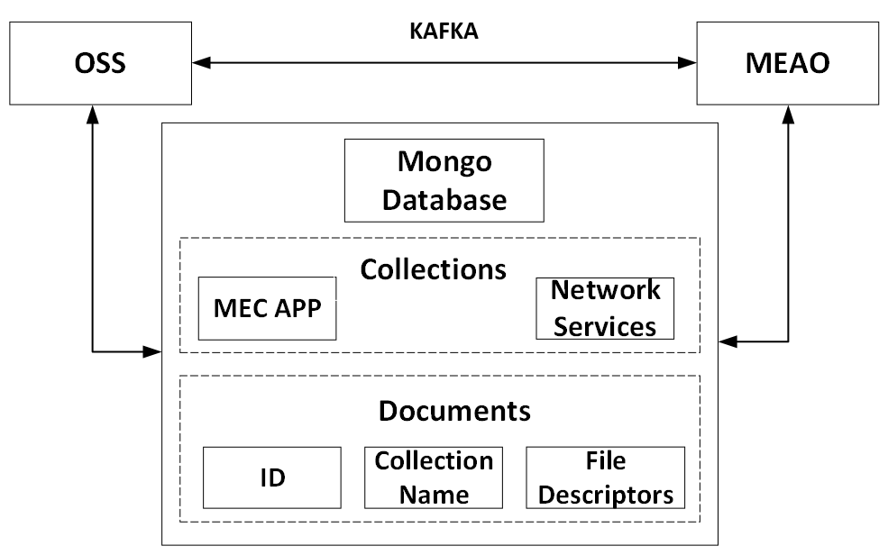

# Project

## Project Goals

- Create a CFS Portal enabling the instantiation, termination and monitoring of MEC Apps.

- Develop an MEC Application Orchestrator capable of deploying MEC Apps as VNFs through OSM platform.

- Create a video processing application to showcase the project's functionalities.

## Main Components

### CFS Portal

The CFS Portal is the UI for interacting with the system. 

- Dashboard: Overview of the system

- App Catalog: View and create MEC Apps

- MEC Instances: View and update instantiated MEC Apps

- VIM Accounts: View and create VIM Accounts

### OSS

The Operations Support System is responsible to redirect the user requests to MEAO.

### MEAO

The MEC Application Orchestrator is responsible for:

- Instantiating, updating, and terminating MEC Apps.

- Deploying MEC Apps as VNFs.

- Monotoring MEC Apps.

## Interaction Between Components

### API

The API enables communication between the CFS Portal and OSS, as well as allowing users to make requests directly to the API instead of using the CFS Portal.

### Kafka

Kafka enables communication between OSS and MEAO.

The Kafka topics available are: 
- new_app_pkg 
- instantiate_app_pkg 
- update_app_pkg 
- terminate_app_pkg 
- delete_app_pkg 
- responses 

### MongoDB

Mongo Database is used to storage of file descriptors. 

MongoDB has two collections:
- App Packages

Each collection has documents. Document fields are: 
- app_id
- name
- provider
- version
- mec-version
- info-name
- description
- appd
- ns_pkg_id
- vnf_pkg_id

## Requests Process Flow

### App Package

#### POST

1. OSS receives a POST request from the CFS Portal
2. OSS validates the app descriptor
3. OSS sends the package and some [fields](#document-fields), belonging to the app descriptor, to the Database
4. Database returns an _id that identifies the document
5. OSS sends the _id through Kafka on the topic, [new_app_pkg](#new_app_pkg), to MEAO
6. MEAO retrieves the app package previously stored in the Database, using the _id
7. MEAO obtains the helm chart and the app descriptor from the app package
8. MEAO validates the app descriptor
9. MEAO translates the app descriptor into a VNF descriptor and a NS descriptor
10. MEAO compresses the vnfd + artifcats + nsd
11. MEAO sends the vnfd to OSM, and receives a [vnf_package_id](#document-fields)
12. MEAO sends the nsd to OSM, and receives a [nsd_package_id](#document-fields)
13. MEAO stores [vnf_package_id](#document-fields) and the [nsd_package_id](#document-fields) in the Database
14. MEAO deletes vnfd and nsd from local storage
15. MEAO returns a response to OSS
16. OSS returns a response 

#### PUT
1. OSS receives a PUT request from the CFS Portal
2. OSS unpacks archive
3. OSS validates the app descriptor
3. OSS parses the app descriptor
4. OSS checks if the app_pkg_id is valid and exists in the Database  
5. OSS sends the app descriptor and the app_pkg_id through Kafka
6. MEAO validates the app descriptor
7. MEAO retrieves the [vnf_package_id](#document-fields) and the [nsd_package_id](#document-fields) from the Database
8. MEAO converts the descriptor to an nsd and a vnfd
9. MEAO compresses and saves the vnfd and nsd in the file storage 
9. MEAO sends a request to update the vnfd and nsd using OSM
10. MEAO receives the response from OSM, and deletes the files from file storage
11. MEAO return a response to OSS
12. OSS receives the response from MEAO
13. OSS updates the Database with the new descriptor 
14. OSS returns a response

#### DELETE

#### GET and LIST

## [Demonstration App](https://github.com/PedroDSFerreira/video-object-detection)

### Purpose:
**This application is used to showcase the onboarding of MEC App.**

### Overview:
**Object detection client-server application.**
**Server receives a video stream from the client. Using YOLOv3, the server processes the video stream and returns the number of detected objects and their position for each frame.**

### Infrastructure:
**The application operates within a Containerized Network Function (CNF), which is a form of Virtualized Network Function (VNF). In this setup, the virtualized hardware runs inside a container on its machine.**

**Deployment:**
**The Demo App is containerized using Docker and is managed by Kubernetes, a container orchestration platform. This setup ensures scalability, reliability, and efficient resource utilization.**

### More Information:
For detailed documentation and access to the codebase, visit the [GitHub repository](https://github.com/PedroDSFerreira/video-object-detection).