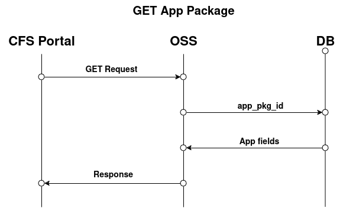

# Project

## Project Goals

- Create a CFS Portal enabling the instantiation, termination and monitoring of MEC Apps.

- Develop an MEC Application Orchestrator capable of deploying MEC Apps as VNFs through OSM platform.

- Create a video processing application to showcase the project's functionalities.

## Main Components

### CFS Portal

The CFS Portal is the UI for interacting with the system. 

- Dashboard: Overview of the system

- App Catalog: View and create MEC Apps

- MEC Instances: View and update instantiated MEC Apps

- VIM Accounts: View and create VIM Accounts

### OSS

The Operations Support System is responsible to redirect the user requests to MEAO.

### MEAO

The MEC Application Orchestrator is responsible for:

- Instantiating, updating, and terminating MEC Apps.

- Deploying MEC Apps as VNFs.

- Monotoring MEC Apps.

## Interaction Between Components

### API

The API enables communication between the CFS Portal and OSS, as well as allowing users to make requests directly to the API instead of using the CFS Portal.

### Kafka

Kafka enables communication between OSS and MEAO.

The Kafka topics available are: 
- new_app_pkg 
- instantiate_app_pkg 
- update_app_pkg 
- terminate_app_pkg 
- delete_app_pkg 
- responses 

### MongoDB

Mongo Database is used to storage of file descriptors. 

Document fields are: 
- app_id
- name
- provider
- version
- mec-version
- info-name
- description
- appd
- ns_pkg_id
- vnf_pkg_id

## Requests Process Flow

### App Package

#### POST

#### GET (List) 

### App Package/`{app_pkg_id}`

#### GET (Individual Package)

#### PUT

#### DELETE

### App Package/`{app_pkg_id}`/instantiate

#### Instantiate

#### Terminate

## [Demonstration App](https://github.com/PedroDSFerreira/video-object-detection)

### Purpose:
This application is used to showcase the onboarding of MEC App.

### Overview:
**Object detection client-server application:**
Server receives a video stream from the client. Using YOLOv3, the server processes the video stream and returns the number of detected objects and their position for each frame.

### Infrastructure:
The application operates within a Containerized Network Function (CNF), which is a form of Virtualized Network Function (VNF). In this setup, the virtualized hardware runs inside a container on its machine.

**Deployment:**
The Demo App is containerized using Docker and is managed by Kubernetes, a container orchestration platform. This setup ensures scalability, reliability, and efficient resource utilization.

### More Information:
For detailed documentation and access to the codebase, visit the [GitHub repository](https://github.com/PedroDSFerreira/video-object-detection).