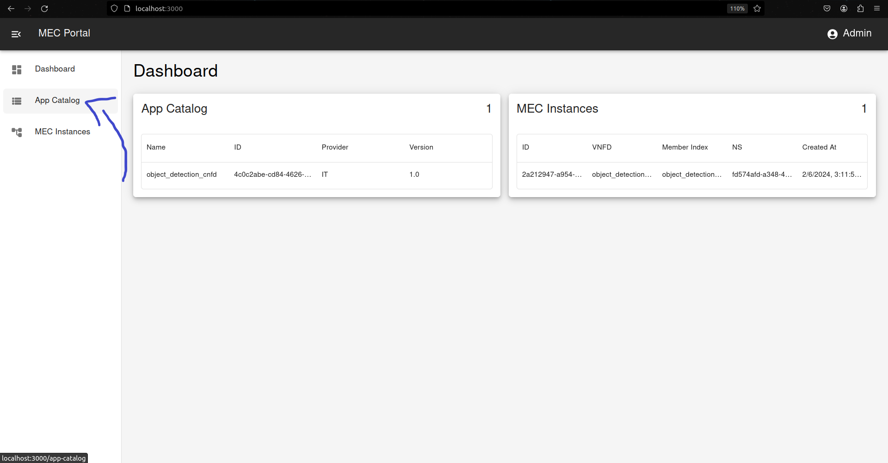
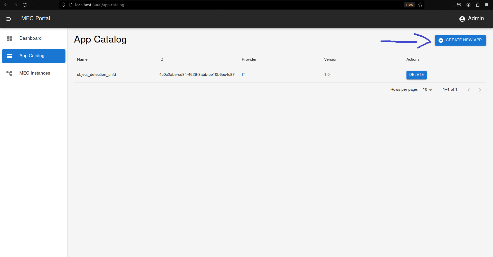

# Getting Started

## Preparation:

1. **Download Repository:**
    ```bash
    git clone https://github.com/PedroDSFerreira/osm-mec.git
    ```

2. **Create .env file:**

    ```bash
    cp .env-sample .env
    ```

    >Change OSM_HOSTNAME variable to the ip of the machine where OSM is installed

3. **Launch Containers:**

    ```bash
    docker compose up --build
    ```


>CFS Portal is available at `http://localhost:3000`

## CFS Portal

### Add MEC App to Catalog
After [creating a MEC App Descriptor](mec_app.md), go to `App Catalog` and upload descriptor:



<br></br>



