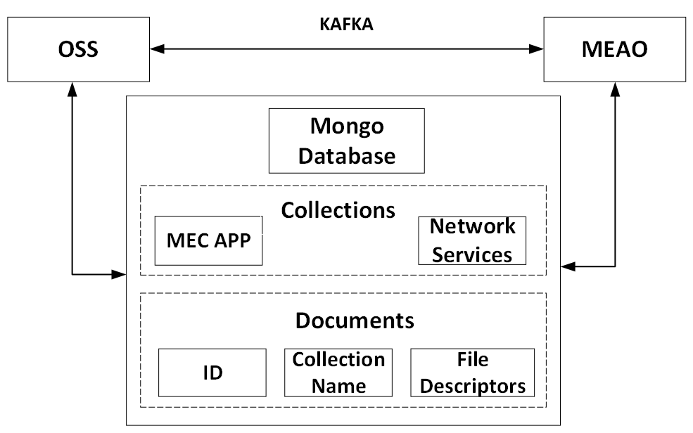

# Project

## Project Goals

- Create a CFS Portal enabling the instantiation, termination and monitoring of MEC Apps.

- Develop an MEC Application Orchestrator capable of deploying MEC Apps as VNFs through OSM platform.

- Create a video processing application to showcase the project's functionalities.

## Main Components

### CFS Portal

The CFS Portal is the UI for interacting with the system. 

- Dashboard: Overview of the system

- App Catalog: View and create MEC Apps

- MEC Instances: View and update instantiated MEC Apps

- VIM Accounts: View and create VIM Accounts

### OSS

The Operations Support System is responsible to redirect the user requests to MEAO.

### MEAO

The MEC Application Orchestrator is responsible for:

- Instantiating, updating, and terminating MEC Apps.

- Deploying MEC Apps as VNFs.

- Managing the lifecycle of MEC Apps.

## Interaction Between Components

### API

The API enables communication between the CFS Portal and OSS, as well as allowing users to make requests directly to the API instead of using the CFS Portal.

### Kafka

Kafka enables communication between OSS and MEAO.

### MongoDB

Mongo Database is used to storage of file descriptors. 

MongoDB has two collections:
- MEC App
- Network Services

Each collection has documents:
- ID: Identifies the MEC App or the NS
- Collection Name
- File Descriptor

### Request Processes Flow

#### Request: Create and Update

1. OSS receives a request from the CFS Portal
2. OSS stores the File Descriptor in the MongoDB
3. MongoDB returns an _id that identifies the document
4. OSS sends the _id through Kafka on a specific topic
5. MEAO executes a callback function corresponding to that topic
6. The _id is then used by the MEAO to access the File Descriptor
7. In the case of MEC App file descriptors, translate them
8. Call an OSM function

#### Request: Get, List

1. OSS receives a request from the CFS Portal.
2. OSS redirects the request using a Kafka topic
3. MEAO executes a callback function corresponding to that topic
4. Call an OSM function

#### Request: Delete

1. OSS receives a request with an ID from the CFS Portal.
2. OSS send the ID, through Kafka on a specific topic
3. MEAO executes a callback function corresponding to that topic
4. Call an OSM function

## [Demonstration App](https://github.com/PedroDSFerreira/video-object-detection)

Client-server application for object detection.

The server receives a video stream from the client through a websocket, processes it using YOLOv3, and returns the number of detected objects and their respective position for each frame.

This application operates within a Containerized Network Function (CNF), which is a Virtualized Network Function (VNF) where the virtualized hardware runs inside a container on its machine. The Demo App runs within a Docker Container, managed by Kubernetes.

Frames are sent periodically to prevent excessive network congestion, as this application is designed for demonstration purposes only.